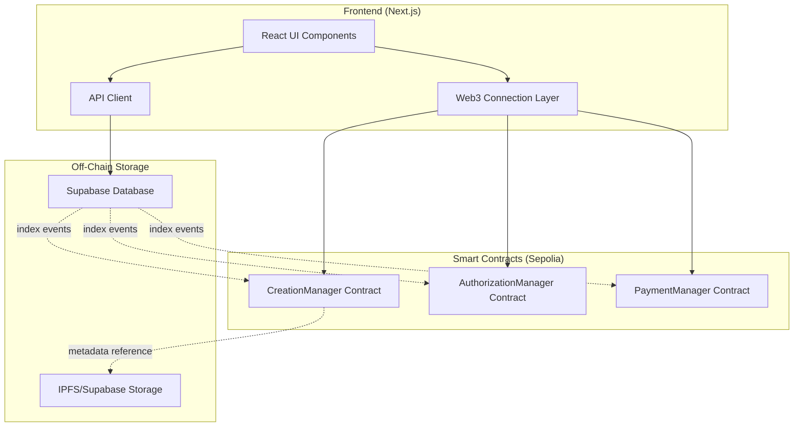

# Design Document

## Overview

This document outlines the technical design for the Web3 Creation Platform smart contract system. The platform enables creators to register original works on-chain, authorize derivative works through paid licenses, and automatically distribute revenue across multi-level creation chains.

The design prioritizes gas efficiency by storing only essential data on-chain while using off-chain storage (Supabase/IPFS) for large metadata. The system uses a pull-payment pattern for revenue distribution to minimize gas costs and improve security.

### Key Design Principles

1. **Minimal On-Chain Storage**: Only store work IDs, creator addresses, parent relationships, and financial data on-chain
2. **Pull Payment Pattern**: Track balances internally and allow creators to withdraw when convenient
3. **Event-Driven Architecture**: Emit comprehensive events for off-chain indexing and UI updates
4. **Gas Optimization**: Use mappings over arrays, pack storage variables, and minimize SLOAD operations
5. **Security First**: Implement reentrancy guards, access controls, and input validation

## Architecture

### System Components



### Contract Architecture

The system uses three main contracts with clear separation of concerns:

1. **CreationManager**: Handles work registration and creation tree relationships
2. **AuthorizationManager**: Manages licensing and authorization tokens
3. **PaymentManager**: Handles tips, license payments, and revenue distribution

This modular design allows for:
- Independent upgrades of each component
- Reduced contract size for lower deployment costs
- Clear responsibility boundaries
- Easier testing and auditing

## Components and Interfaces

### 1. CreationManager Contract

**Purpose**: Manages the registration of original and derivative works, maintains the creation tree structure.

**State Variables**:
```solidity
struct Work {
    uint256 id;
    address creator;
    uint256 parentId;  // 0 for original works
    uint256 licenseFee;  // in wei
    uint256 timestamp;
    bool exists;
}

mapping(uint256 => Work) public works;
mapping(address => uint256[]) public creatorWorks;
mapping(uint256 => uint256[]) public derivatives;  // parentId => childIds
uint256 public nextWorkId;
```

**Key Functions**:

```solidity
function registerOriginalWork(
    uint256 licenseFee,
    string calldata metadataURI
) external returns (uint256 workId)
```
- Creates a new original work (parentId = 0)
- Emits `WorkRegistered` event with metadata URI
- Returns the new work ID

```solidity
function registerDerivativeWork(
    uint256 parentId,
    uint256 licenseFee,
    string calldata metadataURI
) external returns (uint256 workId)
```
- Verifies caller has authorization for parentId (calls AuthorizationManager)
- Creates derivative work with parent reference
- Updates derivatives mapping
- Emits `DerivativeWorkRegistered` event

```solidity
function getWorkChain(uint256 workId) 
    external view returns (uint256[] memory chain)
```
- Traverses parent relationships to return full ancestry chain
- Used for revenue distribution calculations
- Returns array from original work to specified work

```solidity
function getDerivatives(uint256 workId) 
    external view returns (uint256[] memory)
```
- Returns all direct derivative work IDs for a given work

**Events**:
```solidity
event WorkRegistered(
    uint256 indexed workId,
    address indexed creator,
    uint256 licenseFee,
    string metadataURI,
    uint256 timestamp
);

event DerivativeWorkRegistered(
    uint256 indexed workId,
    uint256 indexed parentId,
    address indexed creator,
    uint256 licenseFee,
    string metadataURI,
    uint256 timestamp
);
```

### 2. AuthorizationManager Contract

**Purpose**: Manages authorization tokens and licensing for derivative work creation.

**State Variables**:
```solidity
mapping(uint256 => mapping(address => bool)) public authorizations;  // workId => user => authorized
mapping(address => uint256[]) public userAuthorizations;  // user => workIds
address public creationManager;
address public paymentManager;
```

**Key Functions**:

```solidity
function requestAuthorization(uint256 workId) 
    external payable
```
- Retrieves license fee from CreationManager
- Requires msg.value == licenseFee
- Marks user as authorized for workId
- Forwards payment to PaymentManager for distribution
- Emits `AuthorizationGranted` event

```solidity
function hasAuthorization(address user, uint256 workId) 
    external view returns (bool)
```
- Checks if user is authorized to create derivatives of workId
- Used by CreationManager during derivative registration

```solidity
function getUserAuthorizations(address user) 
    external view returns (uint256[] memory)
```
- Returns all work IDs the user is authorized to derive from

**Events**:
```solidity
event AuthorizationGranted(
    uint256 indexed workId,
    address indexed user,
    uint256 licenseFee,
    uint256 timestamp
);
```

### 3. PaymentManager Contract

**Purpose**: Handles all financial transactions including tips, license payments, and revenue distribution with balance tracking.

**State Variables**:
```solidity
struct RevenueShare {
    uint256 percentage;  // basis points (10000 = 100%)
}

mapping(address => uint256) public balances;
address public creationManager;
uint256 public constant PERCENTAGE_BASE = 10000;

// Revenue split configuration
uint256 public directCreatorShare = 5000;  // 50%
uint256 public ancestorPoolShare = 5000;   // 50% split among ancestors
```

**Key Functions**:

```solidity
function tipCreator(address creator) 
    external payable
```
- Accepts ETH payment
- Updates creator's balance directly (no splitting)
- Tips go 100% to the specified creator
- Emits `TipReceived` event

```solidity
function distributeRevenue(
    uint256 workId,
    uint256 amount
) internal
```
- Called when authorization (license fee) payment is received
- Gets work chain from CreationManager
- Calculates split: 50% to direct creator, 50% distributed among ancestors
- Updates balances for all creators in chain
- Emits `RevenueDistributed` event with all recipients
- Note: This is ONLY for license fees, not tips

```solidity
function withdraw() external
```
- Transfers caller's accumulated balance to their address
- Resets balance to zero
- Uses checks-effects-interactions pattern
- Emits `Withdrawal` event

```solidity
function getBalance(address creator) 
    external view returns (uint256)
```
- Returns accumulated balance for a creator

**Revenue Distribution Logic**:

For a work chain A → B → C → D receiving a license fee payment:
- D (direct creator): 50% of license fee
- Ancestor pool (A, B, C): 50% of license fee split equally
  - A: 16.67%
  - B: 16.67%
  - C: 16.67%

For tips:
- 100% goes directly to the tipped creator
- No splitting across the creation chain

**Events**:
```solidity
event TipReceived(
    address indexed tipper,
    address indexed creator,
    uint256 amount,
    uint256 timestamp
);

event RevenueDistributed(
    uint256 indexed workId,
    address[] recipients,
    uint256[] amounts,
    uint256 totalAmount,
    uint256 timestamp
);

event Withdrawal(
    address indexed creator,
    uint256 amount,
    uint256 timestamp
);
```

## Data Models

### On-Chain Data

**Work Structure**:
- `id`: Unique identifier (uint256)
- `creator`: Creator's wallet address
- `parentId`: Parent work ID (0 for originals)
- `licenseFee`: Cost to create derivatives (wei)
- `timestamp`: Registration time
- `exists`: Existence flag for validation

**Authorization Data**:
- Mapping of workId → user → boolean
- Tracks who can create derivatives

**Balance Data**:
- Mapping of address → uint256
- Accumulated earnings awaiting withdrawal

### Off-Chain Data (Supabase)

**works table**:
```sql
CREATE TABLE works (
    work_id BIGINT PRIMARY KEY,
    creator_address TEXT NOT NULL,
    parent_id BIGINT,
    license_fee TEXT NOT NULL,  -- stored as string to handle big numbers
    metadata_uri TEXT NOT NULL,
    title TEXT,
    description TEXT,
    image_url TEXT,
    created_at TIMESTAMP NOT NULL,
    tx_hash TEXT NOT NULL
);
```

**authorizations table**:
```sql
CREATE TABLE authorizations (
    id SERIAL PRIMARY KEY,
    work_id BIGINT NOT NULL,
    user_address TEXT NOT NULL,
    license_fee TEXT NOT NULL,
    granted_at TIMESTAMP NOT NULL,
    tx_hash TEXT NOT NULL,
    UNIQUE(work_id, user_address)
);
```

**revenue_distributions table**:
```sql
CREATE TABLE revenue_distributions (
    id SERIAL PRIMARY KEY,
    work_id BIGINT NOT NULL,
    recipients JSONB NOT NULL,  -- [{address, amount}]
    total_amount TEXT NOT NULL,
    distributed_at TIMESTAMP NOT NULL,
    tx_hash TEXT NOT NULL
);
```

**Event Indexer**: A backend service (Supabase Edge Function) listens to contract events and populates these tables for efficient querying.

## Error Handling

### Smart Contract Errors

Use custom errors for gas efficiency:

```solidity
error WorkNotFound(uint256 workId);
error NotAuthorized(address user, uint256 workId);
error AlreadyAuthorized(address user, uint256 workId);
error InvalidLicenseFee(uint256 expected, uint256 provided);
error InsufficientBalance(address user, uint256 balance);
error ZeroAmount();
error InvalidParentWork(uint256 parentId);
error WithdrawalFailed(address recipient);
```

### Frontend Error Handling

**Transaction Errors**:
- User rejection: Display friendly message, don't treat as error
- Insufficient funds: Show required amount and user's balance
- Network errors: Prompt to check connection and retry
- Contract revert: Parse error message and display user-friendly version

**MetaMask Connection**:
- Not installed: Show installation instructions with link
- Wrong network: Prompt to switch to Sepolia with automatic switch request
- Account locked: Prompt to unlock MetaMask

**API Errors**:
- Timeout: Retry with exponential backoff
- 404: Display "not found" message
- 500: Display generic error and log for debugging

## Testing Strategy

### Unit Tests (Hardhat)

**CreationManager Tests**:
- Register original work successfully
- Register derivative with valid authorization
- Reject derivative without authorization
- Get work chain correctly for multi-level derivatives
- Get derivatives list
- Handle edge cases (invalid IDs, zero fees)

**AuthorizationManager Tests**:
- Grant authorization with correct payment
- Reject authorization with incorrect payment
- Prevent duplicate authorizations
- Check authorization status correctly
- Track user authorizations

**PaymentManager Tests**:
- Accept tips and update balances
- Distribute revenue correctly across chain
- Calculate splits accurately for various chain lengths
- Handle withdrawal successfully
- Prevent withdrawal with zero balance
- Protect against reentrancy attacks

### Integration Tests

**End-to-End Flows**:
1. Register original work → Request authorization → Register derivative
2. Multi-level chain: A → B → C, then pay C and verify all balances
3. Tip flow: Tip creator and verify balance update
4. Withdrawal flow: Accumulate balance and withdraw

**Gas Optimization Tests**:
- Measure gas costs for each operation
- Compare against benchmarks
- Identify optimization opportunities

### Frontend Tests (Jest + React Testing Library)

**Component Tests**:
- Wallet connection flow
- Work registration form
- Authorization request flow
- Balance display and withdrawal
- Work browsing and filtering

**Integration Tests**:
- Mock Web3 provider
- Test transaction flows
- Verify UI updates after transactions
- Test error handling and user feedback

### Testnet Testing (Sepolia)

**Manual Testing Checklist**:
- [ ] Deploy all contracts to Sepolia
- [ ] Verify contracts on Etherscan
- [ ] Test wallet connection with MetaMask
- [ ] Register multiple original works
- [ ] Request authorizations and verify payments
- [ ] Create multi-level derivative chains
- [ ] Test revenue distribution with real transactions
- [ ] Verify withdrawal functionality
- [ ] Test tip functionality
- [ ] Verify all events are emitted correctly
- [ ] Test with multiple user accounts
- [ ] Verify off-chain data sync with Supabase

## Security Considerations

### Smart Contract Security

**Reentrancy Protection**:
- Use OpenZeppelin's `ReentrancyGuard` on withdrawal function
- Follow checks-effects-interactions pattern
- Update balances before external calls

**Access Control**:
- Only authorized contracts can call cross-contract functions
- Use `onlyCreationManager` modifier where needed
- Validate all inputs

**Integer Overflow/Underflow**:
- Use Solidity 0.8.x built-in overflow checks
- Validate arithmetic operations in revenue distribution

**Front-Running Protection**:
- License fees are fixed at work creation
- No price manipulation possible
- Authorization is one-time per user per work

### Frontend Security

**Private Key Safety**:
- Never request or store private keys
- All signing done through MetaMask
- Educate users about phishing

**Input Validation**:
- Validate all user inputs before sending transactions
- Sanitize metadata before storage
- Check address formats

**HTTPS Only**:
- Enforce HTTPS for all connections
- Secure API endpoints
- Use environment variables for sensitive config

## Deployment Plan

### Contract Deployment Order

1. Deploy `PaymentManager`
2. Deploy `CreationManager` with PaymentManager address
3. Deploy `AuthorizationManager` with CreationManager and PaymentManager addresses
4. Set AuthorizationManager address in CreationManager
5. Verify all contracts on Sepolia Etherscan

### Configuration

**Environment Variables**:
```
NEXT_PUBLIC_CHAIN_ID=11155111  # Sepolia
NEXT_PUBLIC_CREATION_MANAGER_ADDRESS=0x...
NEXT_PUBLIC_AUTHORIZATION_MANAGER_ADDRESS=0x...
NEXT_PUBLIC_PAYMENT_MANAGER_ADDRESS=0x...
NEXT_PUBLIC_RPC_URL=https://sepolia.infura.io/v3/YOUR_KEY
SUPABASE_URL=https://your-project.supabase.co
SUPABASE_ANON_KEY=your-anon-key
```

### Frontend Deployment (Vercel)

1. Connect GitHub repository to Vercel
2. Configure environment variables
3. Set build command: `npm run build`
4. Set output directory: `.next`
5. Deploy to production

### Backend Setup (Supabase)

1. Create Supabase project
2. Run database migrations for tables
3. Deploy Edge Function for event indexing
4. Configure storage bucket for metadata
5. Set up RLS policies for security

## Gas Optimization Strategies

1. **Storage Packing**: Pack related variables into single slots
2. **Mapping Over Arrays**: Use mappings for O(1) lookups
3. **Event Emission**: Use events instead of storing historical data
4. **Batch Operations**: Allow multiple operations in single transaction where possible
5. **Short-Circuit Evaluation**: Order conditionals for early exit
6. **Immutable Variables**: Use `immutable` for deployment-time constants
7. **Custom Errors**: Use custom errors instead of require strings (Solidity 0.8.4+)

## Future Enhancements

1. **Upgradability**: Implement proxy pattern for contract upgrades
2. **Governance**: Add DAO for platform parameter adjustments
3. **NFT Integration**: Mint ERC-721 tokens for works
4. **Royalty Standards**: Implement EIP-2981 for marketplace compatibility
5. **Batch Authorization**: Allow purchasing multiple authorizations at once
6. **Dynamic Revenue Splits**: Allow creators to customize split percentages
7. **Work Categories**: Add tagging and categorization system
8. **Reputation System**: Track creator statistics and ratings
