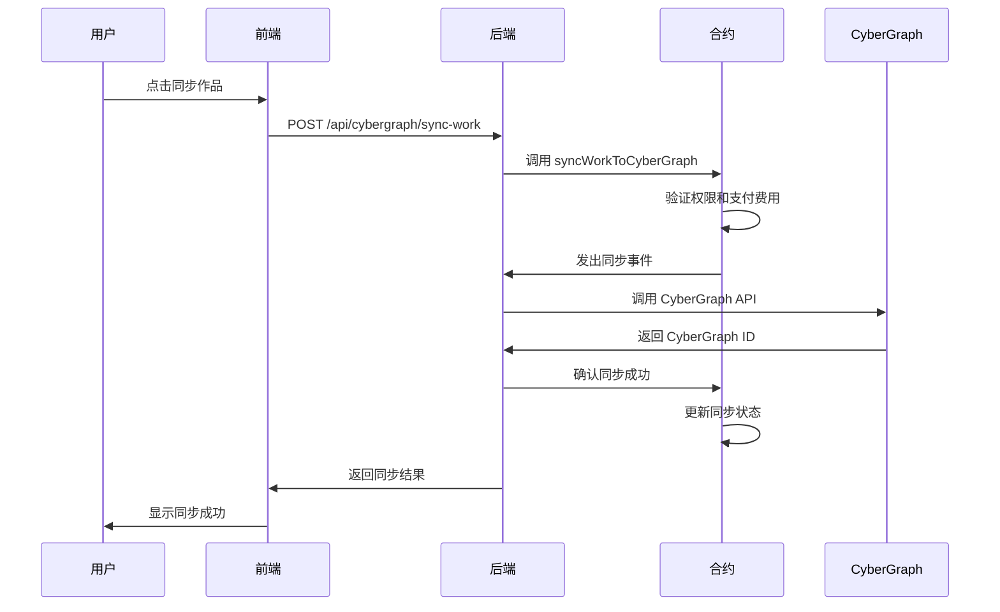
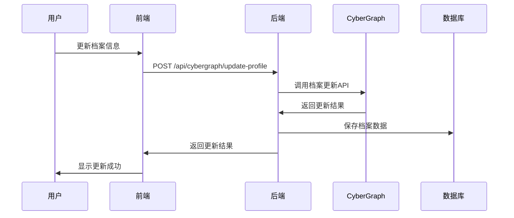

# CyberGraph 集成文档

## 概述

whichWitch平台现已集成CyberGraph社交网络，用户可以将创作内容同步到CyberGraph链上，构建去中心化的创作者社交图谱。

## 核心功能

### 🌐 内容同步
- **作品同步**: 将whichWitch上的作品同步到CyberGraph
- **批量同步**: 一次性同步多个作品
- **状态追踪**: 实时监控同步状态
- **失败重试**: 自动重试失败的同步

### 👤 创作者档案
- **档案管理**: 在CyberGraph上创建和更新创作者档案
- **社交信息**: 集成Twitter、Discord等社交媒体
- **验证状态**: 支持创作者身份验证
- **作品统计**: 自动统计作品数量和互动数据

### 🤝 社交网络
- **关注系统**: 关注其他创作者
- **协作关系**: 标记协作和衍生关系
- **社交图谱**: 可视化创作者网络
- **互动数据**: 追踪点赞、分享、评论

### 🔍 内容发现
- **热门内容**: 发现CyberGraph上的热门作品
- **智能推荐**: 基于兴趣的内容推荐
- **标签系统**: 通过标签发现相关内容
- **搜索功能**: 全文搜索CyberGraph内容

## 技术架构

### 智能合约层

#### CyberGraphSync.sol
```solidity
contract CyberGraphSync {
    // 内容同步到CyberGraph
    function syncWorkToCyberGraph(
        uint256 workId,
        ContentType contentType,
        string calldata contentHash,
        string calldata metadata,
        string calldata socialConnections
    ) external payable;
    
    // 更新创作者档案
    function updateCreatorProfile(
        string calldata cyberGraphHandle,
        string calldata profileData
    ) external;
    
    // 创建社交关系
    function createSocialRelation(
        address following,
        uint256 relationshipType
    ) external;
}
```

### 后端服务层

#### CyberGraph API集成
```javascript
class CyberGraphClient {
    // 创建内容
    async createContent(contentData)
    
    // 更新档案
    async updateCreatorProfile(profileData)
    
    // 创建社交关系
    async createSocialRelation(relationData)
    
    // 搜索内容
    async searchContent(query, filters)
}
```

### 数据库扩展

#### 新增表结构
- `cybergraph_syncs`: 同步记录
- `creator_profiles_cybergraph`: 创作者档案
- `social_relations_cybergraph`: 社交关系
- `cybergraph_content_discovery`: 内容发现

## API接口

### 内容同步

#### 同步单个作品
```http
POST /api/cybergraph/sync-work
Authorization: Bearer <token>
Content-Type: application/json

{
  "workId": 1,
  "contentType": "original_work",
  "contentHash": "QmXxXxXx...",
  "title": "我的作品",
  "description": "作品描述",
  "tags": ["art", "nft"],
  "category": "art"
}
```

#### 批量同步
```http
POST /api/cybergraph/batch-sync
Authorization: Bearer <token>
Content-Type: application/json

{
  "works": [
    {
      "workId": 1,
      "contentType": "original_work",
      "contentHash": "QmXxXxXx...",
      "title": "作品1"
    },
    {
      "workId": 2,
      "contentType": "derivative_work",
      "contentHash": "QmYyYyYy...",
      "title": "作品2"
    }
  ]
}
```

### 创作者档案

#### 更新档案
```http
POST /api/cybergraph/update-profile
Authorization: Bearer <token>
Content-Type: application/json

{
  "cyberGraphHandle": "my_handle",
  "bio": "我是一名数字艺术家",
  "avatar": "https://example.com/avatar.jpg",
  "website": "https://mywebsite.com",
  "social": {
    "twitter": "my_twitter",
    "discord": "my_discord"
  }
}
```

### 社交网络

#### 关注用户
```http
POST /api/cybergraph/follow
Authorization: Bearer <token>
Content-Type: application/json

{
  "followingAddress": "0x123...",
  "relationshipType": 0
}
```

#### 获取社交图谱
```http
GET /api/cybergraph/social-graph/0x123...
```

### 内容发现

#### 搜索内容
```http
GET /api/cybergraph/search?q=art&type=original_work&limit=20
```

#### 获取热门内容
```http
GET /api/cybergraph/trending?category=art&timeframe=24h&limit=20
```

## 同步流程

### 1. 内容同步流程



### 2. 档案更新流程



## 费用结构

### 同步费用
- **基础同步费**: 0.001 ETH
- **批量同步**: 每个作品 0.001 ETH
- **档案更新**: 免费
- **社交操作**: 免费

### 费用用途
- **网络费用**: 支付CyberGraph网络费用
- **中继服务**: 维护跨链中继服务
- **API调用**: CyberGraph API使用费用

## 前端集成

### CyberGraph页面组件

```typescript
// 同步作品
const handleSyncWork = async (workId: number) => {
  const response = await cyberGraphAPI.syncWork({
    workId,
    contentType: 'original_work',
    contentHash: 'QmXxXxXx...',
    title: '我的作品',
    description: '作品描述',
    tags: ['art', 'nft'],
    category: 'art'
  });
  
  if (response.success) {
    toast.success('同步成功！');
  }
};

// 更新档案
const handleUpdateProfile = async () => {
  const response = await cyberGraphAPI.updateProfile({
    cyberGraphHandle: 'my_handle',
    bio: '我是一名数字艺术家',
    avatar: 'https://example.com/avatar.jpg',
    website: 'https://mywebsite.com',
    social: {
      twitter: 'my_twitter',
      discord: 'my_discord'
    }
  });
  
  if (response.success) {
    toast.success('档案更新成功！');
  }
};
```

### 状态管理

```typescript
interface SyncRecord {
  id: number
  syncId: string
  workId: number
  contentType: string
  cyberGraphId?: string
  status: 'pending' | 'syncing' | 'synced' | 'failed'
  createdAt: string
  syncedAt?: string
}

const [syncRecords, setSyncRecords] = useState<SyncRecord[]>([]);
const [syncStats, setSyncStats] = useState({
  total: 0,
  synced: 0,
  pending: 0,
  failed: 0
});
```

## 部署配置

### 环境变量

```bash
# CyberGraph API配置
CYBERGRAPH_API_URL=https://api.cybergraph.xyz
CYBERGRAPH_API_KEY=your_api_key

# 中继服务配置
CYBERGRAPH_RELAY_PRIVATE_KEY=your_private_key
CYBERGRAPH_SYNC_ADDRESS=0x...

# 合约地址
CREATION_MANAGER_ADDRESS=0x...
```

### 合约部署

```bash
# 部署到ZetaChain测试网
npm run deploy:zeta_testnet

# 验证合约
npx hardhat verify --network zeta_testnet <CONTRACT_ADDRESS> <CONSTRUCTOR_ARGS>
```

## 监控和维护

### 同步状态监控
- 监控同步成功率
- 追踪失败原因
- 自动重试机制

### API使用监控
- CyberGraph API调用频率
- 响应时间监控
- 错误率统计

### 用户行为分析
- 同步作品数量统计
- 用户活跃度分析
- 社交互动数据

## 最佳实践

### 内容同步
1. **批量同步**: 对于多个作品，使用批量同步API
2. **错误处理**: 实现重试机制处理网络错误
3. **状态追踪**: 实时显示同步进度给用户

### 档案管理
1. **完整信息**: 鼓励用户填写完整的档案信息
2. **定期更新**: 提醒用户定期更新档案
3. **社交验证**: 验证社交媒体账户的真实性

### 社交网络
1. **有意义的连接**: 鼓励基于真实互动的关注
2. **协作标记**: 准确标记协作和衍生关系
3. **隐私保护**: 尊重用户的隐私设置

## 故障排除

### 常见问题

#### 同步失败
- **原因**: 网络连接问题、API限制、权限不足
- **解决**: 检查网络、验证API密钥、确认用户权限

#### 档案更新失败
- **原因**: 用户名冲突、格式错误、API限制
- **解决**: 检查用户名唯一性、验证数据格式

#### 搜索结果为空
- **原因**: 查询条件过于严格、内容未同步
- **解决**: 放宽搜索条件、确认内容已同步

### 调试工具
- 查看同步日志
- 检查API响应
- 验证合约状态

## 未来规划

### 功能扩展
- **AI推荐**: 基于用户行为的智能推荐
- **跨平台同步**: 支持更多社交平台
- **实时通知**: 实时推送互动通知
- **数据分析**: 提供详细的数据分析报告

### 性能优化
- **缓存机制**: 实现智能缓存减少API调用
- **批量处理**: 优化批量操作性能
- **异步处理**: 使用队列处理大量同步请求

### 用户体验
- **可视化**: 社交图谱可视化展示
- **个性化**: 个性化内容推荐
- **移动端**: 优化移动端体验

## 总结

CyberGraph集成为whichWitch平台带来了强大的社交网络功能，让创作者能够：

1. **扩大影响力**: 将作品同步到更大的社交网络
2. **建立连接**: 与其他创作者建立有意义的连接
3. **发现内容**: 发现和学习其他优秀作品
4. **数据洞察**: 获得详细的互动数据分析

这个集成为Web3创作者生态系统提供了重要的社交基础设施。